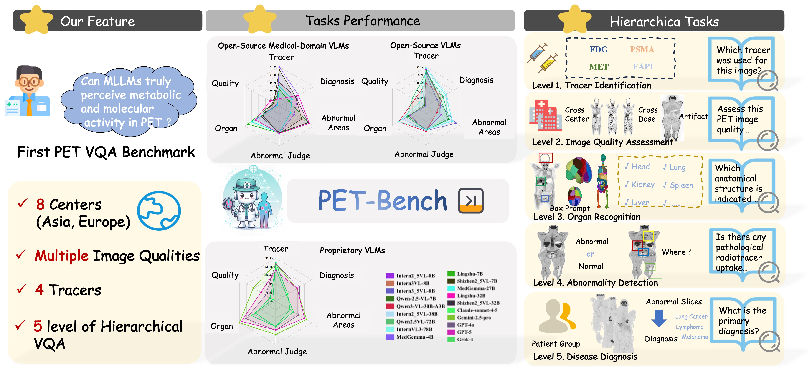

# Unveiling and Bridging the Functional Perception Gap in MLLMs: Atomic Visual Alignment and Hierarchical Evaluation via PET-Bench

[](https://huggingface.co/datasets/TZT21999/PET-Bench)
[](https://github.com/yezanting/PET-Bench)

## Description

PET-Bench is the first large-scale benchmark designed to evaluate the capabilities of Multimodal Large Language Models (MLLMs) in functional imaging, specifically Positron Emission Tomography (PET). Comprising 52,308 hierarchical Question-Answer (QA) pairs from 9,732 multi-site, multi-tracer PET studies, PET-Bench isolates functional perception from morphological priors by using pure PET volumes without PET/CT overlays.

The benchmark addresses a critical gap in medical AI: while current MLLMs excel in anatomical modalities (e.g., X-ray, CT, MRI), their performance on functional imaging remains unexplored. PET-Bench reveals a "functional perception gap" where models struggle to decode tracer biodistribution independent of structural features, and identifies a "Chain-of-Thought (CoT) hallucination trap" where CoT prompting can lead to clinically fluent but factually ungrounded diagnoses.

### Key Features

- **Scale**: 52,308 QA pairs across 9,732 studies from 8 international centers.
- **Tracers**: FDG, PSMA, FAPI, MET.
- **Hierarchical Taxonomy**: 5-level structure mirroring nuclear medicine workflows:
  - Level 1: Tracer Identification
  - Level 2: Image Quality Assessment
  - Level 3: Organ Recognition
  - Level 4: Abnormality Detection
  - Level 5: Disease Diagnosis
- **Data Sources**: Aggregated from public repositories (e.g., AutoPET III) and proprietary cohorts, including whole-body and total-body PET/CT systems.

PET-Bench serves as a rigorous testbed for developing safer, visually grounded MLLMs for PET and other functional modalities.

<div align="center">
  
</div>

## Dataset Structure

The dataset is organized into hierarchical levels, with each level containing QA pairs, images, and annotations. The structure is as follows:

```
PET-Bench/
├── PET_Tracer_Identification/
│   ├── images/
│   ├── pet_tracer_identification_qa.json
├── Level2_ImageQualityAssessment/
........
```

For detailed statistics on class distributions and curation protocols, refer to the paper.

## Usage

### Loading the Dataset

To load PET-Bench using the Hugging Face `datasets` library:

```python
from datasets import load_dataset

# Load the entire dataset
dataset = load_dataset("TZT21999/PET-Bench")

# Load a specific level
level1_dataset = load_dataset("TZT21999/PET-Bench", "PET_Tracer_Identification")
```

### Evaluation

PET-Bench tasks are evaluated by accuracy on multiple-choice questions. For CoT-based evaluation, use the provided prompts and auxiliary LLM scorer (details in the paper).

**The Evaluation will be available at https://github.com/yezanting/PET-Bench**

## Requirements

- Python 3.8+
- Hugging Face Datasets library: `pip install datasets`
- For image processing: `pip install nibabel pydicom`

## Citation

If you use PET-Bench in your research, please cite the following paper:

```bibtex
@article{ye2026unveiling,
  title={Unveiling and Bridging the Functional Perception Gap in MLLMs: Atomic Visual Alignment and Hierarchical Evaluation via PET-Bench},
  author={Ye, Zanting and Niu, Xiaolong and Wu, Xuanbin and Han, Xu and Liu, Shengyuan and Hao, Jing and Peng, Zhihao and Sun, Hao and Lv, Jieqin and Wang, Fanghu and others},
  journal={arXiv preprint arXiv:2601.02737},
  year={2026}
}
```

## License

This dataset is released under the [CC BY 4.0 License](https://creativecommons.org/licenses/by/4.0/). Please ensure compliance with ethical guidelines for medical data usage.

## Contact

For questions or collaborations, contact the authors:

- Zanting Ye: yzt2861252880@gmail.com

Dataset curation involved contributions from 8 international centers. We thank all collaborators for their expertise in nuclear medicine.
