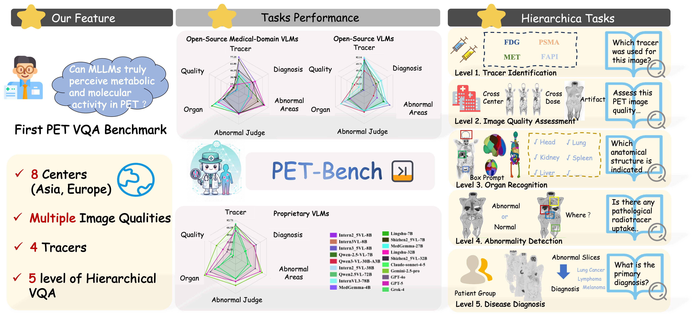

# PET-Bench

**Unveiling and Bridging the Functional Perception Gap in MLLMs: Atomic Visual Alignment and Hierarchical Evaluation via PET-Bench**

[](https://arxiv.org/abs/2601.02737)
[](https://huggingface.co/datasets/TZT21999/PET-Bench)
[](https://github.com/yezanting/PET-Bench)

PET-Bench evaluates whether multimodal large language models (MLLMs) can interpret **functional and molecular activity in PET images**. It contains **52,308 question–answer pairs derived from 9,732 PET studies**, spanning eight data centers in Asia and Europe and four tracer families: FDG, PSMA, FAPI, and MET.

The benchmark follows a five-level clinical workflow, from identifying the tracer to diagnosing disease. Level 4 contains two subtasks, giving **six evaluation tasks** in total. Models receive PET images without CT or PET/CT fusion overlays, so they must interpret tracer biodistribution and uptake patterns from the functional signal itself.



## Contents

- [Why PET-Bench?](#why-pet-bench)
- [Tasks and data](#tasks-and-data)
- [Repository contents](#repository-contents)
- [Getting started](#getting-started)
- [Evaluation](#evaluation)
- [Published results](#published-results)
- [Atomic Visual Alignment](#atomic-visual-alignment)
- [Citation](#citation)
- [License and contact](#license-and-contact)

For implementation details, see the [dataset guide](docs/DATASET.md) and [evaluation guide](docs/EVALUATION.md).

## Why PET-Bench?

Strong performance on X-ray, CT, or MRI does not establish that a model understands PET. Structural modalities emphasize anatomy, whereas PET interpretation depends on tracer-specific physiological uptake, relative intensity, noise, and the spatial distribution of abnormal activity.

PET-Bench separates these skills into individual tasks to help locate failures: does a model misidentify the tracer, mistake noise for disease, fail to recognize an organ, overlook an abnormal focus, or misinterpret findings at diagnosis?

The accompanying [paper](https://arxiv.org/abs/2601.02737) investigates two related phenomena:

- **Functional perception gap:** models trained primarily on structural images struggle to ground their answers in PET uptake patterns.
- **CoT hallucination trap:** a coherent chain of thought can remain detached from the visual evidence. More plausible reasoning does not necessarily produce a more accurate diagnosis.

The paper also introduces **Atomic Visual Alignment (AVA)**, which trains lower-level PET perception skills before evaluating disease diagnosis.

## Tasks and data

| Level | Task | Visual input | Expected answer | Skill assessed |
| --- | --- | --- | --- | --- |
| 1 | Tracer Identification (TI) | One coronal PET slice | One option letter | Recognizing tracer-specific biodistribution |
| 2 | Image Quality Assessment (IQA) | One coronal PET slice | Two option letters | Assessing quality and artifact presence together |
| 3 | Organ Recognition (OR) | One PET slice with a highlighted organ | One option letter | Recognizing functional anatomy |
| 4a | Abnormality Identification (AI) | One coronal PET slice | One option letter: Normal or Abnormal | Separating physiological and pathological uptake |
| 4b | Abnormal Area Detection (AAD) | One PET slice with colored region boxes | One option letter identifying a box color | Localizing abnormal uptake among candidate regions |
| 5 | Disease Diagnosis (DD) | An ordered sequence of up to 15 PET slices | One diagnostic option letter | Integrating uptake distribution across slices |

The Level-5 reference set contains **471 cases**, with ground-truth diagnoses of lung cancer, lymphoma, and melanoma. Answer options may include additional diagnostic distractors; the set of ground-truth classes is not the complete option vocabulary.

The source studies include whole-body and total-body scanners, standard acquisitions, and reduced-count reconstructions. PET volumes are SUV-normalized before task-specific coronal images are selected. CT-derived masks support annotation during curation, but CT images are not supplied to the evaluated model.

The [dataset guide](docs/DATASET.md) explains sample counts, slice selection, JSON fields, and path resolution.

## Repository contents

```text
PET-Bench/
├── README.md
├── Fig1.jpg
├── docs/
│   ├── DATASET.md
│   └── EVALUATION.md
└── eval_code/
    └── Lingshu-7B/
        ├── Lingshu7B_eval_level1_PET_tracer_identification.py
        ├── Lingshu7B_eval_level2_PET_image_quality_v2_prompt.py
        ├── Lingshu7B_eval_level3_PET_Organ_Identification.py
        ├── Lingshu7B_eval_level4_PET_Normal_Abnormal_classification.py
        ├── Lingshu7B_eval_Level4_Region_box_Color_Choice_Localization_v2_last.py
        ├── Lingshu7B_eval_level5_PET_cancer_diagnose.py
        └── Lingshu7B_eval_level5_PET_cancer_diagnose_CoT.py
```

This repository provides **Lingshu-7B evaluation examples** for all six tasks and Level-5 CoT inference. Data are distributed separately on Hugging Face. The broader model comparison and AVA experiments are reported in the paper; this checkout does not contain AVA training scripts, fine-tuned checkpoints, or the auxiliary LLM judge implementation.

## Getting started

### 1. Clone the code and prepare an environment

```bash
git clone https://github.com/yezanting/PET-Bench.git
cd PET-Bench
python -m venv .venv
source .venv/bin/activate
python -m pip install --upgrade pip
```

Use a Python environment supported by your chosen PyTorch and model dependencies; Python 3.10 or 3.11 is a practical starting point. Install a CUDA-compatible PyTorch build following the [official installation instructions](https://pytorch.org/get-started/locally/), then install the inference dependencies:

```bash
python -m pip install "transformers==4.52.1" accelerate qwen-vl-utils pillow tqdm huggingface_hub
```

The [Lingshu model card](https://huggingface.co/lingshu-medical-mllm/Lingshu-7B) recommends Transformers 4.52.1. The released scripts use BF16, automatic device placement, and `flash_attention_2`; install a compatible [FlashAttention](https://github.com/Dao-AILab/flash-attention#installation-and-features) build for your CUDA/PyTorch environment before running them. These are setup instructions, not a fully pinned reproduction environment.

### 2. Obtain dataset access and download

The [Hugging Face dataset](https://huggingface.co/datasets/TZT21999/PET-Bench) is **gated**. Sign in on its page and complete the access request before downloading. Authenticate locally with an account that has access:

```bash
hf auth login
hf download TZT21999/PET-Bench --repo-type dataset --local-dir ./dataset
```

Alternatively, download through Python:

```python
from huggingface_hub import snapshot_download

snapshot_download(
    repo_id="TZT21999/PET-Bench",
    repo_type="dataset",
    local_dir="./dataset",
)
```

The release packages image files in compressed shards. With GNU tar and zstd installed, verify and extract them:

```bash
cd dataset
sha256sum -c SHA256SUMS
mkdir -p data
for shard in shards/*.tar.zst; do
  tar --zstd -xf "$shard" -C data
done
cd ..
```

`SHA256SUMS` checks shard integrity; `manifest/manifest.jsonl` maps original file paths to shards. Keep relative paths preserved during extraction. See [release layout and path checks](docs/DATASET.md#download-layout-and-path-resolution) before configuring a task. A Git + Git LFS download alternative is documented there as well.

### 3. Configure and run a task

Obtain the [Lingshu-7B checkpoint](https://huggingface.co/lingshu-medical-mllm/Lingshu-7B). In the chosen evaluation script, edit the configuration block under `if __name__ == "__main__":`:

| Setting | Meaning |
| --- | --- |
| `MODEL_PATH` | Local checkpoint directory or supported Hugging Face model ID |
| `PROCESSOR_PATH` | Matching processor directory or model ID |
| `JSON_FILE_PATH` | Task annotation JSON file |
| `DATASET_ROOT_DIR` | Directory joined with each record's relative image path |
| `OUTPUT_LOG_DIR` | Writable result directory; use a separate directory per experiment |

The scripts contain development-machine paths or placeholders and do not expose command-line flags for these settings. Replace them before execution. `DATASET_ROOT_DIR` must resolve the image paths in the JSON; it is not necessarily the JSON file's parent directory.

For example, after configuring Level 1:

```bash
python eval_code/Lingshu-7B/Lingshu7B_eval_level1_PET_tracer_identification.py
```

The [evaluation guide](docs/EVALUATION.md) maps every task to its script, describes outputs and CoT resume behavior, and explains how to adapt the examples to another model.

## Evaluation

PET-Bench reports answer accuracy separately for TI, IQA, OR, AI, AAD, and DD. Preserve each sample's option order: letters are positional labels, and the same category may correspond to different letters in different records.

Level 2 requires a joint answer: one selection for image quality and one for artifact presence. Level 5 uses multiple images in one model request. Its CoT variant follows six steps: tracer identification, expected physiological uptake, quality assessment, abnormal uptake detection, disease reasoning, and final diagnosis.

**Scoring details matter for reproduction.** The released examples use permissive letter matching, and missing images or processing failures can reduce the accuracy denominator. Their CoT script performs local answer parsing and reasoning-step logging; it does not run the paper's auxiliary accuracy or plausibility judges. Consult the [scoring notes](docs/EVALUATION.md#scoring-and-comparability) before comparing a new run with the paper.

For integration with [VLMEvalKit](https://github.com/open-compass/VLMEvalKit), convert the JSON annotations into a custom dataset and provide task-specific handling for Level-2 multi-label answers and Level-5 multi-image inputs. Conversion scripts and a PET-specific VLMEvalKit adapter are not included in this public checkout. See the [integration guidance](docs/EVALUATION.md#using-vlmevalkit).

## Published results

The following results are transcribed from **Table 4 of [arXiv:2601.02737v2](https://arxiv.org/html/2601.02737v2#S5.T4)**. All values are accuracy (%); they are published results, not measurements generated by this documentation update. Model names follow the paper's table.

| Model | TI | IQA | OR | AI | AAD | DD |
| --- | ---: | ---: | ---: | ---: | ---: | ---: |
| **Open-source general models** | | | | | | |
| InternVL2.5-8B | 77.21 | 1.36 | 39.60 | 50.90 | 36.83 | 33.55 |
| InternVL3-8B | 74.21 | 4.02 | 46.50 | 50.60 | 26.81 | 32.48 |
| InternVL3.5-8B | 68.67 | 0.86 | 55.94 | 51.96 | 72.73 | 26.33 |
| Qwen2.5-VL-7B | 74.12 | 4.30 | 42.44 | 51.09 | 54.25 | 33.76 |
| Qwen3-VL-30B | 48.31 | 27.82 | 66.43 | 53.78 | 26.60 | 40.98 |
| InternVL2.5-38B | 82.14 | 8.20 | 56.49 | 51.10 | 62.20 | 49.89 |
| Qwen2.5VL-72B | 70.04 | 33.05 | 46.48 | 50.64 | 57.04 | 40.98 |
| InternVL3-78B | 79.54 | 15.67 | 66.43 | 49.17 | 64.61 | 47.13 |
| **Open-source medical models** | | | | | | |
| MedGemma-4B | 77.25 | 5.56 | 52.85 | 53.91 | 32.68 | 33.55 |
| Lingshu-7B | 32.94 | 12.89 | 70.14 | 52.51 | 64.10 | 21.23 |
| Shizhen2.5VL-7B | 71.13 | 12.99 | 36.81 | 53.14 | 49.89 | 36.31 |
| MedGemma-27B | 38.89 | 4.29 | 61.03 | 52.14 | 25.24 | 28.03 |
| Lingshu-32B | 14.92 | 20.63 | 53.14 | 52.99 | 67.02 | 39.27 |
| Shizhen2.5VL-32B | 46.22 | 15.05 | 40.30 | 51.30 | 64.48 | 36.73 |
| **Proprietary models** | | | | | | |
| Claude-sonnet-4.5 | 74.01 | 6.43 | 55.39 | 48.97 | 32.64 | 27.60 |
| Gemini-2.5-pro | 71.81 | 51.02 | 82.73 | 64.23 | 70.44 | 48.41 |
| GPT-4o | 71.92 | 22.84 | 67.57 | 55.86 | 52.60 | 54.78 |
| GPT-5 | 58.80 | 33.79 | 78.05 | 55.49 | 65.67 | 49.47 |
| Grok-4 | 63.61 | 12.57 | 45.96 | 49.10 | 40.51 | 24.77 |

The hierarchy reveals substantial task-specific variation. For example, Lingshu-7B achieves 70.14% organ recognition but 21.23% diagnosis accuracy. GPT-4o has the highest DD accuracy in this zero-shot comparison, while Gemini-2.5-pro has the highest IQA and OR accuracies.

CoT effects depend on the model. [Table 5](https://arxiv.org/html/2601.02737v2#S5.T5) reports Qwen2.5-VL-7B changing from 33.76% to 31.63% DD accuracy with CoT, despite a plausibility score of 0.94. This illustrates why diagnostic correctness and reasoning plausibility should be reported separately.

## Atomic Visual Alignment

AVA uses supervised fine-tuning on **Levels 1–4 only**, with LoRA adaptation, to align models with lower-level PET perception. Level-5 diagnostic labels are excluded from training, and patients used for Level-5 testing are held out from AVA training across all lower-level tasks.

The table below summarizes [Table 6](https://arxiv.org/html/2601.02737v2#S5.T6). Gains are **percentage points (pp)** relative to the frozen baseline, rather than relative percentage improvements.

| Model | Baseline DD (%) | AVA DD (%) | AVA + CoT DD (%) | AVA + CoT gain (pp) |
| --- | ---: | ---: | ---: | ---: |
| MedGemma-4B | 33.55 | 41.83 | 48.38 | +14.83 |
| InternVL3-8B | 32.48 | 37.58 | 48.38 | +15.90 |
| Qwen2.5-VL-7B | 33.76 | 35.03 | 41.40 | +7.64 |
| Lingshu-7B | 21.23 | 23.81 | 35.88 | +14.65 |

These are paper results. The released evaluation examples can be adapted to a compatible fine-tuned checkpoint; AVA training and patient-split reproduction require additional artifacts not included in this checkout.

## Citation

If you use PET-Bench in your research, please cite:

```bibtex
@article{ye2026unveiling,
  title={Unveiling and Bridging the Functional Perception Gap in MLLMs: Atomic Visual Alignment and Hierarchical Evaluation via PET-Bench},
  author={Ye, Zanting and Niu, Xiaolong and Wu, Xuanbin and Han, Xu and Liu, Shengyuan and Hao, Jing and Peng, Zhihao and Sun, Hao and Lv, Jieqin and Wang, Fanghu and others},
  journal={arXiv preprint arXiv:2601.02737},
  year={2026},
  doi={10.48550/arXiv.2601.02737},
  url={https://arxiv.org/abs/2601.02737}
}
```

## License and contact

The dataset is released under [CC BY 4.0](https://creativecommons.org/licenses/by/4.0/), as stated in the dataset documentation. Access is subject to the requirements on its Hugging Face page. This dataset license statement does not establish a separate license for the code; no code `LICENSE` file is currently included in this repository. Model checkpoints retain their respective upstream licenses.

For questions about access, reproduction, or collaboration, contact **Zanting Ye** at [yzt2861252880@gmail.com](mailto:yzt2861252880@gmail.com), or open a [GitHub issue](https://github.com/yezanting/PET-Bench/issues).

We thank the participating centers and nuclear medicine collaborators, and acknowledge [VLMEvalKit](https://github.com/open-compass/VLMEvalKit), [Lingshu](https://huggingface.co/lingshu-medical-mllm/Lingshu-7B), and the public PET resources described in the paper.
